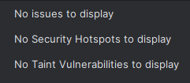

# Atelier 3 - Repository notes

## 1) Choix des interfaces Repository

| Interface | Etend | Justification |
|---|---|---|
| `IAgenceRepository` | `JpaRepository<Agence, Long>` | CRUD complet + `List`, tri et pagination sur les agences. |
| `IEmployeRepository` | `JpaRepository<Employe, Long>` | CRUD complet + `List`, tri et pagination sur les employes. |
| `IVehiculeRepository` | `JpaRepository<Vehicule, Long>` | CRUD complet + `List`, tri et pagination sur les vehicules. |
| `IEquipementRepository` | `JpaRepository<Equipement, Long>` | CRUD complet + `List`, tri et pagination sur les equipements. |
| `IClientRepository` | `JpaRepository<Client, Long>` | CRUD complet + `List`, tri et pagination sur les clients. |
| `IReservationRepository` | `JpaRepository<Reservation, Long>` | CRUD complet + `List`, tri et pagination sur les reservations. |
| `IContratRepository` | `JpaRepository<Contrat, Long>` | CRUD complet, `findAll` renvoie une `List`, `saveAndFlush` disponible. |
| `IPaiementRepository` | `JpaRepository<Paiement, Long>` | Lecture/consultation des paiements et operations CRUD standards. |
| `IMaintenanceRepository` | `JpaRepository<Maintenance, Long>` | CRUD complet + `List`, tri et pagination sur les maintenances. |

**Verification**
- Les 9 interfaces `I...Repository` existent dans `src/main/java/tn/esprit/autoloc/repository`.
- Toutes etendent `JpaRepository<Entite, Long>`.
- Au redemarrage, le log attendu est : `Found 9 JPA repository interfaces`.

## 2) Anomalies SonarQube for IDE et plan de correction

- Les points qualite Sonar sont traces avec leur correction dans cette note.
